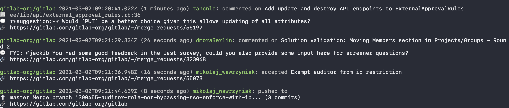

# Gitlab events

Toy cli to continuously watch gitlab events for multiple projects, because Gitlab notifications suck.



```
go build

// Watch projects with id 11, 15, and 100 (will only show events for public projects)
./gitlab-events 11 15 100

// Watch projects with id 11, 15, and 100 with a custom url and a token
./gitlab-events -url mycompany.gitlab.com -token="$GITLAB_TOKEN" 11 15 100

// Watch projects with id 11, 15, and 100 and output json objects (one on each line) for scripts to consume
./gitlab-events -json 11 15 100
```


## LICENSE
MIT
